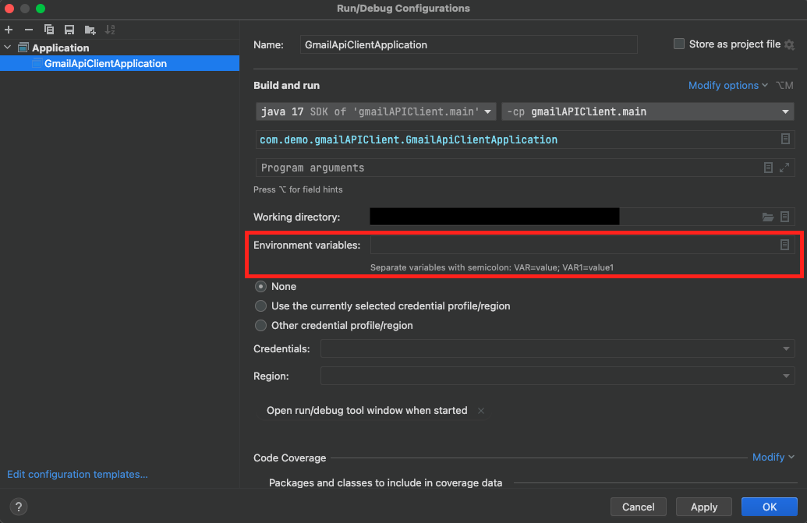
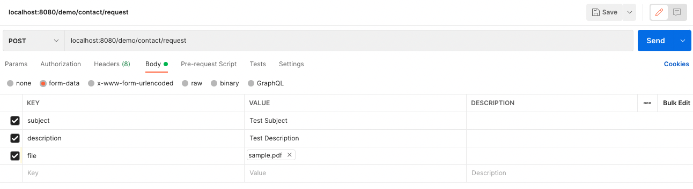

# Gmail API Client with Java Spring Boot

This repository includes the source code for an API built with Java Spring Boot that makes use of the Gmail API in order to send emails with an attachment.

This tutorial presents how to use the Gmail API with an OAuth Credential requiring a one-time-only authorization action by the sender Gmail account owner (using google's refresh token). This means that the sender does not need to login or authorize the API everytime we need to send an email (he does this only one time).


## You will learn how to 
- Create OAuth Credential for Google APIs integration with your application.
- Authorize a Gmail account for Gmail API use and retrive its refresh token.
- Implement Gmail API's access token refresh in order to need a one-time-only account's owner action to authorize/login. 
- Integrate Google's Gmail API with your Java Spring Boot own API in order to send emails with attachments. 


## Table of Contents.

1. [Use Case Examples](#step1)
2. [Setting up Credentials and Tokens](#step2)
    1. [Creating OAuth Credential and Refresh Token for Gmail Account](#step3)
    2. [Adding Credentials as Environment Variables in IntelliJ](#step4)
1. [Implementation](#step5)
    1. [Create OAuth Credential through token refresh](#step6)
        1. [Alternative ways to create Credential object](#step7)
    2. [Add a Java MultipartFile object as an email attachment](#step8)
    3. [Test demo endpoint](#step9)
5. [References](#step10)


<a name="step1"/>

## Use Case Examples

[Google's Gmail API](https://developers.google.com/gmail/api) lets you view and manage your Gmail inbox and supports features like reading and sending emails, managing drafts and attachments and others. 

This repository and its source code proposes a particular use for this API. Our goal is to use the Gmail API in order to send emails from a specific email account to some other email address. Examples of this use includes:

- Having a specific gmail account from where account confirmation emails are sent to a new user registering in our app. In this case, we send email from some organization/admin Gmail account to the user's email.
- Having a contact form in our website where users can submit requests. In this case, we can send an email from a fixed account (admin-example@gmail.com) to the department's email that is going to handle the request.
- Sending marketing emails.

All these three cases have in common the fact that those emails are going to be sent from a previosly defined and fixed Gmail account, like an administration account or a department's account. But the email can be sent to any account, including to an account belonging to some user of our application.

This could be achieved with the many SMTP providers available but the majority of them requires a more complex setting of a SMTP server in your own application server. By using the Gmail API we are not require to set and mantain any SMTP server.

The source code on this repository shows an API with a single endpoint to submit a contact form with a subject, a description and a file. Then, an email is sent from a previously defined and fixed gmail account containing that information. The recipient address in this example is also defined in the environment's variable but it can be defined at runtime (for example, an email address specified by the user on the API request).

<a name="step2"/>

## Setting up Credentials and Tokens 

<a name="step3"/>

### Creating OAuth Credential and Refresh Token for Gmail Account

For a step-by-step tutorial on how to create a Google Cloud project and how to create an OAuth Credential and a refresh token for the sender Gmail account refer to this [documentation](./docs/credentials.md).

<a name="step4"/>

### Adding Credentials as Environment Variables in IntelliJ

This source code on this stores the *Google Client Id*, *Google Client Secret*, *sender account's Gmail Refresh Token*, *sender email address* and *recipient email address* in the environment variables. 

So, in order to build and test the demo code you need to create your own credentials and tokens an save it on your IDE's environment variables (or for testing purposes, replace them directly in the application.yaml file).

The environment variables should be in the form of

```
GOOGLE_CLIENT_ID=XXXXXXX;GOOGLE_CLIENT_SECRET=XXXXXXX;GOOGLE_REFRESH_TOKEN=XXXXXXX;GOOGLE_FROM_EMAIL=XXXXXXX;GOOGLE_TO_EMAIL=XXXXXXX
```

But depending on the use case, the recipient email address *(TO_EMAIL)* can be specified during run-time having no need to store it on the environment variables. 




<a name="step5"/>

## Implementation

The source code contains an *POST* endpoint in order to submit a subject (*String*), description (*String*) and a file (*MultipartFile*). When the endpoint is called, it triggers the Gmail API service to send an email from and to a specified emails address, sending the file as an attachment.

On this section, some important parts of the implementation are addressed. Please, keep in mind that the code snippets presented are not complete (check the source code for the complete version).

<a name="step6"/>

### Create OAuth Credential through token refresh

In order to create a Gmail service instance you need an OAuth credential and the sender Gmail's access token to authenticate your application and your account, respectively, with the Gmail API. 

```java
Credential credential = authorize();

return new Gmail.Builder(httpTransport, JSON_FACTORY, credential)
    .build();
```

This *Credential* object can be built in different ways according to the required behaviour and use case. 

In the available demo, the goal is to not require the sender account owner to perform any action in order for the the application to be able to use his Gmail to send emails. The only action needed from him is a single-time authorization in order to retrieve a *refresh token* that is stored by the application (please, read this [documentation](./docs/credentials.md)). By having this *refresh token* we can ask for a valid *access_token* without any user's action.

To build a *Credential* object from an *access token* you can use the response that you get from requesting the *access token* from the *refresh token* using a POST request to *https://www.googleapis.com/oauth2/v4/token* google's endpoint. 


```java
GmailCredential gmailCredentialsDto = new GmailCredential(
      clientId,
      secretKey,
      refreshToken,
      "refresh_token",
      null,
      null
    );

HttpEntity<GmailCredential> entity = new HttpEntity(gmailCredentialsDto);

GoogleTokenResponse tokenResponse = restTemplate.postForObject(
    "https://www.googleapis.com/oauth2/v4/token",
    entity,
    GoogleTokenResponse.class);

```

This *tokenResponse* can then be used to create a Credential object.

```java
Credential credential = new Credential(BearerToken.authorizationHeaderAccessMethod()).setFromTokenResponse(
    tokenResponse);
```

This is how you can make sure you always have a valid access token and how you can authenticate the account in order to send emails without requiring account owner action.

<a name="step7"/>

#### Alternative ways to create Credential object

**Alternative 1**

On the other hand, if you want the sender account owner to login / accept API use everytime you want to send an email you can build *Credential* object through [GoogleAuthorizationCodeFlow](https://cloud.google.com/java/docs/reference/google-api-client/latest/com.google.api.client.googleapis.auth.oauth2.GoogleAuthorizationCodeFlow).

With this code, an url is automatically returned that takes the user to the Google Account login prompt. After the user logins and authorizes the API use, it returns the *access token*. This is a possible approach where you want to send emails from your application user's own Gmail account (and not from a well and previously specified account address). 

```java
InputStream in = new FileInputStream("credentials.json");

GoogleClientSecrets clientSecrets =
  GoogleClientSecrets.load(JSON_FACTORY, new InputStreamReader(in));

GoogleAuthorizationCodeFlow flow =
  new GoogleAuthorizationCodeFlow.Builder(
    httpTransport, JSON_FACTORY, clientSecrets, Collections.singletonList(GmailScopes.MAIL_GOOGLE_COM))
    .setAccessType("offline")
    .build();

LocalServerReceiver receiver = new LocalServerReceiver.Builder().setPort(8888).build();

Credential credential = new AuthorizationCodeInstalledApp(
  flow, receiver).authorize("user");
```

Please, note that in this example we are loading *OAuth Client ID* and *OAuth Client Secret* from a *"credentials.json* file and not from the environment variables. It works both ways. 

With this approach you don't need to use Google OAuth Playground in order to retrieve a refresh token (since it is retrieved in real-time) but you still need a *OAuth Client ID* and *OAuth Client Secret* to authenticate your application.


**Alternative 2**

You can also send emails from a [Google Service Account](https://cloud.google.com/iam/docs/service-accounts).

```java
ServiceAccountCredentials serviceAccountCredentials = ServiceAccountCredentials.fromPkcs8(
    clientId,
    senderEmail,
    serviceAccountKey,
    serviceAccountId,
    GmailScopes.all());

GoogleCredentials delegatedCredentials = serviceAccountCredentials.createDelegated(delegatedUserEmail);

HttpRequestInitializer requestInitializer = new HttpCredentialsAdapter(delegatedCredentials);
```

**Alternative 3**

In the past, you could use the [GoogleCredential](https://javadoc.io/doc/com.google.api-client/google-api-client/1.33.2/com/google/api/client/googleapis/auth/oauth2/GoogleCredential.html) class in order to create the Credential object. This class is now deprecated and, therefore, should not be used anymore.

```java
Credential credential = new GoogleCredential().Builder()
  .setTransport(httpTransport)
  .setJsonFactory(JSON_FACTORY)
  .setClientSecrets(gmailCredentials.client_id(), gmailCredentials.client_secret())
  .build()
  .setAccessToken(gmailCredentials.access_token())
  .setRefreshToken(gmailCredentials.refresh_token());
```


<a name="step8"/>

### Add a Java MultipartFile object as an email attachment

In the provided example, the API received the file as a *MultipartFile*. This object needs to be converted to a *DataSource* to be added to the email as a *MimeMultipart*.

On the next code snippet, the *attachment* object is the *MultipartFile* we received on the POST request body.

```java
Multipart multipart = new MimeMultipart();

MimeBodyPart mimeBodyPart = new MimeBodyPart();

mimeBodyPart.setContent(bodyText, "text/plain");

multipart.addBodyPart(mimeBodyPart);

mimeBodyPart = new MimeBodyPart();

DataSource ds = new ByteArrayDataSource(attachment.getBytes(), attachment.getContentType());
mimeBodyPart.setDataHandler(new DataHandler(ds));
mimeBodyPart.setFileName(attachment.getOriginalFilename());

multipart.addBodyPart(mimeBodyPart);

email.setContent(multipart);
```

<a name="step9"/>

### Test demo endpoint

In order to test the source code, you can do a POST request as shown in the next screenshot. 



Keep in mind that in the provided demo, the sender and recipient emails are defined in the environment variables (or directly in application.yaml file for testing purposes).


<a name="step10"/>

## References

[Gmail API main](https://developers.google.com/gmail/api)\
[Gmail API Java Quickstart](https://developers.google.com/gmail/api/quickstart/java)
